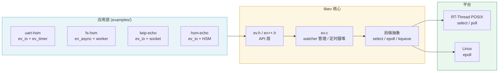

# libev 4.33 — RT-Thread 移植版

[English](README.md) · [简体中文](README_zh.md)

libev 4.33 的 fork，在保留上游 Linux/BSD/Windows 支持的基础上，新增
RT-Thread MCU 移植，并在嵌入式目标上验证事件循环的可用性。

## 结论摘要

libev 4.33 已在 RT-Thread 5.2.2（STM32F407 + Renode 全系统仿真）上验证
可用：select 后端、ev_io / ev_timer / ev_async 三类 watcher 全部跑通，
4 个示例自检通过。RT-Thread 的 select 后端与 Linux 的 epoll 后端在事件
语义上等价。

## 项目定位

libev 是一个高性能、全功能的事件循环库，实现 Reactor 模式。它将操作
系统的 I/O 多路复用机制（select / poll / epoll / kqueue / port /
linuxaio / iouring）统一到一套 API，覆盖 IO、定时器、信号、子进程、
文件系统等事件类型。

本 fork 在上游 4.33 基础上新增：

- `configs/rt-thread.h`：RT-Thread 专用 select-only 后端配置。RT-Thread
  POSIX 层提供 `select`，其余后端与 Linux 专有内核特性全部裁剪。
- 4 个可运行示例，均在 STM32F407（Renode 全系统仿真）上验证。
- `docs/` 下的概要设计（HLD）与详细设计（LLD）文档。

## 总体架构



libev 采用单编译单元：`ev.c` 直接 `#include` `src/unix/` 与 `src/win/`
下的后端源码，后端不单独编译。

## 后端支持

| 平台 | 后端 |
|---|---|
| Linux | epoll（默认）、select、poll、linuxaio、iouring |
| BSD / macOS | kqueue |
| Solaris | port |
| Windows | select |
| RT-Thread MCU | select（`configs/rt-thread.h`） |

## 目录结构

```
include/    公共头文件：ev.h、ev++.h、event.h
src/        核心：ev.c、event.c、ev_vars.h、ev_wrap.h
src/unix/   unix 后端：epoll、kqueue、poll、port、select、linuxaio、iouring
src/win/    windows 后端：ev_win32.c
configs/    rt-thread.h（RT-Thread select-only 配置）
examples/   4 个可运行示例（Linux + RT-Thread）
test/       smoke 测试
docs/       ev.3 / ev.pod（API 参考）、HLD / LLD 设计文档
```

## 示例

| 示例 | Watcher | 演示内容 | RT-Thread |
|---|---|---|---|
| `uart-hsm` | ev_io + ev_timer | HSM 状态机驱动的 UART 协议解析 | 已验证 |
| `uart-ring-hsm` | ev_async + 环形缓冲 | ISR -> ring -> libev -> HSM（贴近真实 MCU） | 覆盖 |
| `fs-hsm` | ev_async + worker | 异步文件写，心跳证明事件循环不被阻塞 | 已验证 |
| `lwip-echo` | ev_io | 基于 LwIP SAL socket 的 TCP echo 服务 | 已验证 |
| `hsm-echo` | ev_io | HSM 连接生命周期 + socket | 覆盖 |

"已验证" = 在 RT-Thread STM32F407（Renode）上自检通过；
"覆盖" = 通过其他示例覆盖（同一 HSM 引擎或同一 socket 通路）。

## 构建

### Linux / macOS / BSD

```sh
cmake -S . -B build
cmake --build build
ctest --test-dir build --output-on-failure
```

CMake 选项：`BUILD_SHARED_LIBS`、`BUILD_STATIC_LIBS`、`BUILD_TESTING`、
`EV_SANITIZER`（`address`/`thread`/`undefined`）、`EV_WERROR`。

### RT-Thread MCU

用 `-DEV_CONFIG_H='"rt-thread.h"'` 编译 `src/ev.c`，并把 `configs/` 加入
头文件搜索路径。完整特性集见 `configs/rt-thread.h`。已在 RT-Thread
5.2.2 / STM32F407（Renode 1.16.1）上验证。

## 验证结论

| 平台 | 后端 | 结果 |
|---|---|---|
| Linux x86 | epoll | 4/4 示例自检通过 |
| RT-Thread STM32F407（Renode） | select | uart-hsm PASS、fs-hsm PASS、lwip-echo PASS（loopback 回显） |

## 文档

- [docs/libev-HLD-Design.md](docs/libev-HLD-Design.md) — 概要设计
- [docs/libev-LLD-Design.md](docs/libev-LLD-Design.md) — 详细设计
- [docs/ev.3](docs/ev.3) — API 参考（man page）

## 许可证

BSD 2-clause，亦可选择 GPLv2+。见 [LICENSE](LICENSE)。

## 上游

基于 [libev 4.33](http://software.schmorp.de/pkg/libev)，作者 Marc
Lehmann 与 Emanuele Giaquinta。
