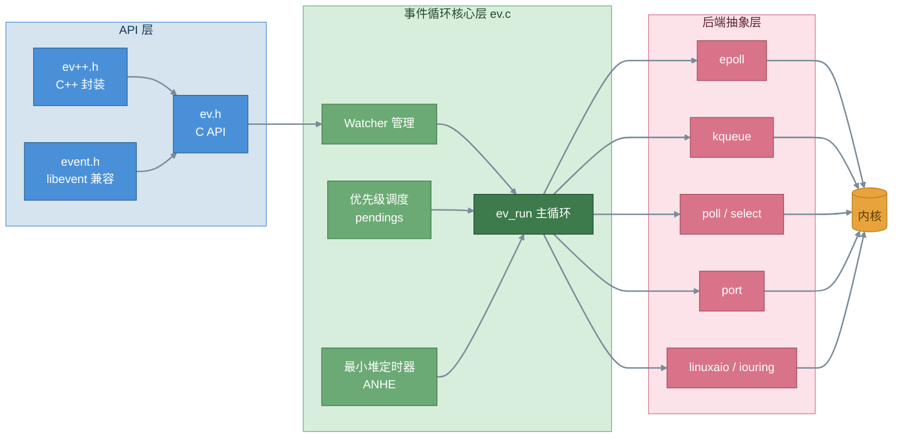
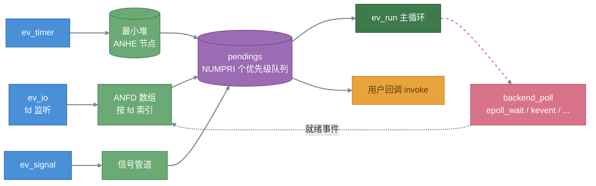

# libev 概要设计文档

## 1. 引言

### 1.1 编写目的

本文档给出 libev 事件循环库的概要设计，覆盖整体架构、核心组件职责划分与模块间关系，供后续详细设计（见《libev 详细设计文档》）与二次开发评审使用。

### 1.2 范围

libev 是一个用 C 语言编写的高性能全功能事件循环库，对多种操作系统 I/O 多路复用机制（select / poll / epoll / kqueue / port / linuxaio / iouring）提供统一抽象，支持 IO、定时器、信号、子进程、文件监控等事件类型。本文档覆盖其架构设计与关键机制，不涉及具体函数实现细节。

### 1.3 参考资料

1. 深入理解libev：高性能事件循环库的核心机制（CSDN gitblog_00667）
2. libev事件库解析：数据结构与 ev_run 流程（CSDN shadou0109）
3. 事件驱动库 libev 使用详解（CSDN weixin_52622200 / 攻城狮百里）
4. libev 官方文档 ev.pod（随源码发布，docs/ev.3）

## 2. 总体架构

### 2.1 设计模式

libev 基于 Reactor 模式。应用程序注册感兴趣的事件源（文件描述符可读、定时器到期、信号到达等），libev 统一管理这些事件源，事件发生时通过回调通知应用程序。核心结构为一个事件循环，阻塞等待内核事件通知，分发到对应回调执行。

### 2.2 分层结构

系统自顶向下分为三层：

- **API 层**：公共头文件 ev.h / ev++.h（C++ 封装）/ event.h（libevent 兼容层），提供 `ev_init`、`ev_io_start`、`ev_run` 等接口
- **事件循环核心层**：ev.c 单编译单元实现，负责 watcher 生命周期管理、优先级队列调度、时间管理、最小堆定时器
- **后端抽象层**：各 OS 多路复用实现的统一封装，由 ev.c 在编译期通过 `#include` 内联进单一编译单元

### 2.3 目录结构（libuv 风格重组后）

| 目录 | 职责 |
|---|---|
| include/ | 公共头文件：ev.h、ev++.h、event.h |
| src/ | 核心：ev.c（主循环）、event.c（兼容层）、ev_vars.h、ev_wrap.h |
| src/unix/ | Unix 后端：ev_epoll.c 等 7 个 |
| src/win/ | Windows 后端：ev_win32.c |
| test/ | 冒烟测试 |
| docs/ | ev.3（man page）、ev.pod（文档源码） |

## 3. 核心组件

### 3.1 组件清单

| 组件 | 职责 |
|---|---|
| ev_loop | 事件循环实例，聚合全部运行时状态 |
| Watcher 体系 | 事件观察者，"基类" ev_watcher + 各具体类型（ev_io / ev_timer / ev_signal 等） |
| 后端 Backend | 多路复用抽象，编译期选择，运行时可枚举 |
| 优先级队列 pendings | 按 NUMPRI 个优先级组织的待处理事件二维数组 |
| 最小堆 timers | 基于 ANHE 节点的二叉堆，管理超时 watcher |
| 时间管理 | ev_tstamp（double 秒）、单调时钟 mn_now 与实时时钟双轨 |

### 3.2 组件拓扑关系

### 3.3 Watcher 类型概览

**基础事件**：ev_io（IO）、ev_timer（相对时间定时器）、ev_periodic（墙上时间定时器，类 crontab）、ev_signal（信号）、ev_child（子进程，基于 SIGCHLD）、ev_stat（文件监控，Linux 用 inotify 加速）。

**扩展事件**：ev_fork（fork 检测）、ev_embed（嵌入其他循环）、ev_async（跨线程唤醒，内部管道实现）。

**循环 Hook**：ev_idle（空闲）、ev_prepare（每次阻塞前）、ev_check（每次事件处理后）、ev_cleanup（循环销毁时）。

## 4. 关键设计决策

### 4.1 单编译单元架构

ev.c 在编译期内联 `#include` 各后端 .c 文件，全部编译为单一翻译单元。优点：编译器可见全部代码便于内联优化、符号管理简单；代价：无法按需编译单个后端。目录重组后通过 include 路径保持该机制不变。

### 4.2 时间双轨制

ev_tstamp 为 double 类型秒。内部同时维护单调时钟（mn_now，系统开机时间）与实时时钟，差值 rtmn_diff 用于时间跳变处理：ev_timer 基于单调时钟不受系统调时影响；ev_periodic 基于墙上时间，遵循时间调整（调快一个月则延后一个月触发）。

### 4.3 优先级调度

每个 watcher 有 priority 字段（-2 至 +2，数值越大越先执行）。待处理事件按优先级放入 pendings 二维数组，回调阶段从高优先级到低优先级逆序取出执行。同优先级内按事件入队顺序逆序触发。

### 4.4 线程模型

libev 本身非线程安全。官方多线程模式：每个线程独立事件循环（ev_loop_new 创建，注意全局仅一个默认循环）；线程间通过 ev_async 唤醒（ev_async_send 可从其他线程调用）；共享数据需外部锁保护。

### 4.5 fork 处理

默认不自动检测 fork。三种方式应对：`EVFLAG_FORKCHECK` 标志（每次迭代检查）、fork 后显式调用 `ev_loop_fork()`、依赖 ev_fork watcher 在子进程中重建内核机制。

### 4.6 错误处理分级

- 操作系统错误：`ev_set_syserr_cb()` 设置自定义回调
- 使用错误（如负的定时器间隔）：触发标准 `assert()` 断言失败（本仓库版本未提供断言接管接口）
- 内部错误：表明 libev 自身 bug

## 5. 外部接口与性能设计

### 5.1 事件循环

- `ev_default_loop(flags)`：获取默认循环（支持子进程事件）
- `ev_loop_new(flags)`：创建新循环（多实例/多线程场景）
- `ev_run(loop, flags)`：进入主循环；`ev_break()`：退出
- `ev_loop_destroy()`：销毁循环，触发 ev_cleanup watcher

### 5.2 Watcher 通用生命周期

`ev_TYPE_init`（初始化回调与参数）→ `ev_TYPE_start`（注册进循环）→ 事件触发回调 → `ev_TYPE_stop`（注销）。所有 watcher 遵循同一模式，另支持 `ev_init` + `ev_TYPE_set` 两步式初始化。

### 5.3 后端选择

`ev_supported_backends()` 列出编译支持的后端，`ev_recommended_backends()` 列出当前平台推荐后端；通过 flags 或 `EV_USE_*` 宏强制指定。

### 5.4 性能设计要点

1. 后端择优：Linux 优先 epoll（新内核可用 iouring），BSD 用 kqueue，Solaris 用 port
2. ANFD 按 fd 直接下标索引，IO 事件路径无哈希查找
3. 最小堆管理超时，epoll_wait 超时值取堆顶时间计算，避免无谓唤醒
4. watcher 为普通 C 结构体，建议复用而非频繁创建销毁
5. 可通过 `EV_*_ENABLE` 编译宏裁剪不需要的事件类型（如 EV_STAT_ENABLE=0），缩小体积
