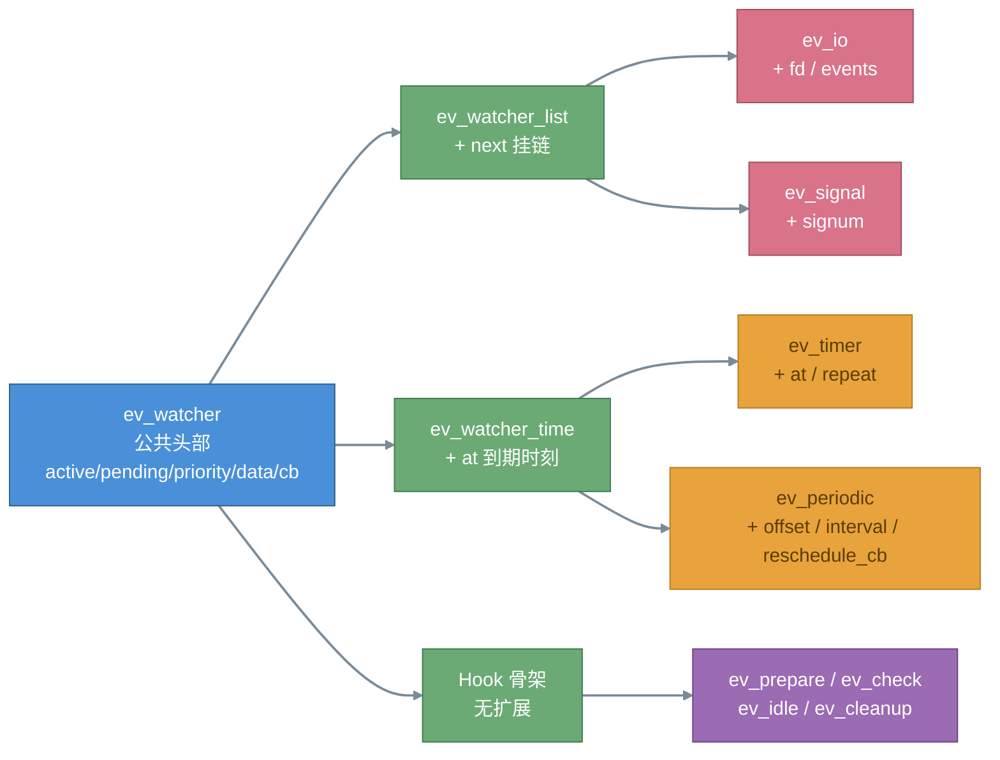
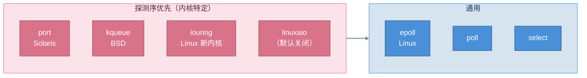

# libev 详细设计文档

## 1. 引言

### 1.1 编写目的

本文档在概要设计基础上给出 libev 的详细设计：核心数据结构的字段级定义、ev_run 主循环的逐步执行流程、事件从内核到回调的完整传递路径、各 Watcher 类型的行为细节与配置裁剪机制。供源码阅读、二次开发与问题定位使用。

### 1.2 源码位置约定

本文档引用的文件路径均相对仓库根目录（libuv 风格布局）：核心实现在 `src/ev.c`，公共头 `include/ev.h`，后端 `src/unix/`。

## 2. 核心数据结构

### 2.1 Watcher "基类"体系

libev 用 C 模拟继承：所有 watcher 结构体前若干字段布局一致，可安全地在 `ev_watcher*` 与具体类型间转换。

**ev_watcher（公共头部）**：

```c
typedef struct ev_watcher {
    int active;      /* 激活标志：已 start 且在循环中 */
    int pending;     /* 等待事件数（已入 pendings 队列） */
    int priority;    /* 优先级，范围 [-2, +2]，越大越先执行 */
    void *data;      /* 用户自定义数据，回调中取回 */
    void (*cb)(struct ev_loop *loop, struct ev_watcher *w, int revent);
} ev_watcher;
```

**三类派生骨架**：

| 结构体 | 在公共头部基础上增加 | 用途 |
|---|---|---|
| ev_watcher_list | `struct ev_watcher_list *next` | 需要挂链的事件（ev_io、ev_signal） |
| ev_watcher_time | `ev_tstamp at` | 时间类事件（ev_timer、ev_periodic） |
| ev_prepare / ev_check 等 | 无扩展 | 循环 Hook |

**ev_timer 完整定义**：

```c
typedef struct ev_timer {
    int active; int pending; int priority;
    void *data;
    void (*cb)(struct ev_loop *loop, struct ev_timer *w, int revents);
    ev_tstamp at;      /* 下次到期时刻 */
    ev_tstamp repeat;  /* 周期间隔，0 表示一次性 */
} ev_timer;
```

**ev_io 完整定义**：

```c
typedef struct ev_io {
    int active; int pending; int priority;
    void *data;
    void (*cb)(struct ev_loop *loop, struct ev_io *w, int revents);
    struct ev_watcher_list *next;
    int fd;        /* 监听的文件描述符 */
    int events;    /* EV_READ / EV_WRITE / 两者按位或 */
} ev_io;
```

ev_signal 同 ev_io 布局，末字段为 `int signum`。

Watcher 继承拓扑：



### 2.2 ev_loop 结构体

```c
struct ev_loop {
    ev_tstamp ev_rt_now;                 /* 实时时间缓存 */
    #define VAR(name, decl) decl;
    #include "ev_vars.h"                 /* 展开全部成员 */
    #undef VAR
};
```

成员由 `src/ev_vars.h` 以 `VAR(名字, 声明)` 宏列表维护：单实例模式下展开为 `static` 变量，多实例模式（EV_MULTIPLICITY）展开为结构体成员，由 `src/ev_wrap.h` 提供同名宏透明访问。关键成员：

| 成员 | 类型 | 职责 |
|---|---|---|
| now_floor | ev_tstamp | 上次刷新实时时间的时间 |
| mn_now | ev_tstamp | 当前单调时钟（系统开机时间） |
| rtmn_diff | ev_tstamp | 实时时钟 - 单调时钟的差值 |
| backend | int | 当前后端标记（EVBACKEND_EPOLL/KQUEUE/IOURING/POLL/SELECT/PORT/...） |
| backend_fd | int | 后端实例 fd（epoll 即 epoll_create 返回值） |
| activecnt | int | 激活事件总数 |
| anfds | ANFD[] | 按 fd 下标索引的监听登记表 |
| fdchanges / fdchangecnt | int[] / int | 待重新注册的 fd 变更队列 |
| pendings[NUMPRI] | ANPENDING*[] | 各优先级待处理事件队列 |
| pendingcnt[NUMPRI] | int[] | 各优先级当前队列长度 |
| timers / periodics | 堆 | 最小堆（ANHE 节点） |

### 2.3 ANFD 与 ANPENDING

```c
typedef struct {                 /* fd 登记项，anfds[fd] 直接索引 */
    ev_watcher_list *head;       /* 该 fd 上的 watcher 链表头 */
    unsigned char events;        /* 用户关注的事件位 */
    unsigned char reify;         /* 变更状态位（EV_ANFD_REIFY / EV__IOFDSET） */
    unsigned char emask;         /* 内核侧已注册的事件 mask（如 epoll） */
    unsigned char eflags;        /* 后端自用的 flags 字段 */
#if EV_USE_EPOLL
    unsigned int egen;           /* epoll 代数计数（防陈旧事件，仅 epoll 编译时存在） */
#endif
} ANFD;

typedef struct {                 /* 待处理事件项 */
    ev_watcher *w;               /* 就绪的 watcher */
    int events;                  /* 就绪的事件位 */
} ANPENDING;
```

多 watcher 监听同一 fd 时通过 ANFD.head 链表串联；epoll 模式下 emask 与 events 比对决定是否需要 `epoll_ctl` 修改注册。

### 2.4 最小堆节点 ANHE

ANHE 有两种编译期形态（`src/ev.c`）：

```c
#if EV_HEAP_CACHE_AT
  typedef struct {
      ev_tstamp at;            /* 到期时刻缓存，堆排序键 */
      ev_watcher_time *w;      /* 指向时间类 watcher */
  } ANHE;
#else
  typedef ev_watcher_time *ANHE;   /* 裸指针，at 即 w->at */
#endif
```

timers 与 periodics 各用一个二叉最小堆维护，堆顶即最近到期时刻，用于计算 backend_poll 的超时参数。

## 3. 主循环与事件传递

### 3.1 ev_run 主循环详细流程

```mermaid
flowchart LR
    S["ev_run 入口"] --> FD["fd_reify<br/>处理 fdchanges 队列<br/>同步注册到内核 backend"]
    FD --> TM["time_update<br/>刷新 mn_now / ev_rt_now<br/>检测时间跳变"]
    TM --> PR["prepare watchers<br/>逐个回调"]
    PR --> TL["计算超时<br/>取堆顶 timer 与周期事件<br/>得到 timeout 参数"]
    TL --> BP["backend_poll<br/>epoll_wait / kevent / poll / select<br/>带 timeout 阻塞"]
    BP --> IN["invoke_cb / ev_invoke_pending<br/>按优先级从高到低执行 pendings"]
    IN --> CK["check watchers<br/>逐个回调"]
    CK --> DE{"判断退出条件<br/>ev_break 被调用或<br/>activecnt == 0"}
    DE -- 继续 --> FD
    DE -- 退出 --> E["返回 ev_run"]

    style S fill:#4A90D9,stroke:#2C5F8A,color:#FFFFFF
    style FD fill:#6BAA75,stroke:#3D7A4C,color:#FFFFFF
    style TM fill:#6BAA75,stroke:#3D7A4C,color:#FFFFFF
    style PR fill:#9B6BB3,stroke:#6A4280,color:#FFFFFF
    style TL fill:#6BAA75,stroke:#3D7A4C,color:#FFFFFF
    style BP fill:#D9738A,stroke:#A04A5E,color:#FFFFFF
    style IN fill:#E8A33D,stroke:#B57B1D,color:#5C3D00
    style CK fill:#9B6BB3,stroke:#6A4280,color:#FFFFFF
    style DE fill:#F2C14E,stroke:#B57B1D,color:#5C3D00
    style E fill:#4A90D9,stroke:#2C5F8A,color:#FFFFFF
    linkStyle default stroke:#7A8B99,stroke-width:2px
    linkStyle 8 stroke:#6BAA75,stroke-width:2px
```



逐阶段说明：

1. **fd_reify**：遍历 fdchanges 队列，比对 ANFD.events 与 ANFD.emask，调用后端的 `epoll_modify` 等接口同步内核注册状态，清空 reify 标志。
2. **time_update**：从 `now_floor` 缓存机制决定是否调用 `clock_gettime` 刷新时间；通过 mn_now 与上次值的比较检测时间跳变（配合 timerfd 可进一步减少唤醒频率，timerfd 仅用于 periodics 的时钟跳变检测）。
3. **prepare 阶段**：执行全部 ev_prepare watcher，此时尚可修改任意 watcher 的事件注册。
4. **超时计算**：取 timers 堆顶、periodics 下次触发点、idle/prepare 存在性共同决定 backend_poll 的阻塞超时；无任何活动 watcher 时按 flags 决定行为。
5. **backend_poll**：调用选定后端阻塞等待。以 epoll 为例即 `epoll_wait`，就绪事件经 `fd_event_nocheck` 处理。
6. **ev_invoke_pending**：从最高优先级队列开始逆序取出 ANPENDING，调用 watcher->cb。回调内可嵌套 start/stop 任意 watcher。
7. **check 阶段**：执行全部 ev_check watcher。
8. **退出判定**：`ev_break(EVBREAK_ONE)` 使当前轮次后退出，`EVBREAK_ALL` 立即退出所有嵌套 ev_run；activecnt 归零且非 EVRUN_NOWAIT 时自然退出。

### 3.2 事件传递路径（以 epoll 为例）


细节：

- 同一 fd 上多个 watcher 时，仅事件位匹配（`w->events & revents`）的 watcher 被入队。
- 定时器到期事件独立路径：backend_poll 返回后逐个检查堆顶 `ANHE.at <= mn_now`，就绪的 watcher 先放入 rfeeds 数组，再逆序转入 pendings。
- 信号事件经内部信号管道（或 signalfd，配置相关）转为可读 fd，复用同一条 ev_io 路径。

## 4. 后端选择与 Watcher 行为

### 4.1 后端选择：编译期

`src/ev.c` 顶部依据 config.h（由 config.h.cmakein 生成）的 `HAVE_SYS_EPOLL_H`、`HAVE_EPOLL_CTL`、`HAVE_SYS_EVENT_H`、`HAVE_KQUEUE`、`HAVE_SYS_TIMERFD_H`、`HAVE_LINUX_FS_H`、`HAVE_KERNEL_RWF_T` 等宏决定各 `EV_USE_*` 默认值，随后以条件编译内联对应后端文件：

```c
#if EV_USE_EPOLL
# include "ev_epoll.c"
#endif
#if EV_USE_IOURING
# include "ev_iouring.c"
#endif
/* kqueue / poll / select / port / linuxaio 同理 */
```

### 4.2 后端选择：运行期

- `ev_supported_backends()`：编译进二进制的后端集合
- `ev_recommended_backends()`：平台推荐集合（如 macOS 屏蔽 kqueue/poll，仅推荐 select）
- 用户可通过 `ev_loop_new(EVBACKEND_EPOLL | EVFLAG_NOENV)` 显式指定

后端初始化探测顺序（`src/ev.c`，首个成功者胜出）：port > kqueue > iouring > linuxaio > epoll > poll > select（Windows 下另有 IOCP 置于最前）。注意这与 `EVBACKEND_*` 标志位数值顺序不同，iouring 并非默认首选。

后端优先级拓扑：



### 4.3 Watcher 初始化两式

```c
/* 一步式 */
ev_io_init(&w, cb, fd, EV_READ);
/* 两步式：init 之后可随时 set，便于复用结构体 */
ev_init(&w, cb);
ev_io_set(&w, fd, EV_READ);
```

### 4.4 ev_timer

- `ev_timer_init(&w, cb, after, repeat)`：after 秒后首次触发；repeat 为周期，0 表示一次性；repeat 非 0 时回调内自动按 repeat 重新入堆
- 基于单调时钟：系统调时不影响触发时刻
- `ev_timer_again` 可在回调中动态调整 repeat 值

### 4.5 ev_periodic

- 基于墙上时间（UTC），行为类似 crontab：`ev_periodic_init(&w, cb, offset, interval, reschedule_cb)`
- 遵循时间调整：定时 10 秒后触发，期间系统时间被调快一个月，则实际在一个月零 10 秒后触发（ev_timer 无此现象）
- interval 为 0 且提供 reschedule_cb 时完全自定义下次触发时刻

### 4.6 ev_signal / ev_child

- ev_signal：`ev_signal_init(&w, cb, SIGINT)`，回调内 `w->signum` 取信号值；`ev_feed_signal()` 可模拟信号注入
- ev_child：内部注册 SIGCHLD，`w->rpid` / `w->rstatus` 分别为子进程 PID 与退出状态；仅默认循环支持

### 4.7 ev_async（跨线程）

- 内部管道（或 eventfd）实现；`ev_async_send(loop, &w)` 是唯一可从其他线程安全调用的 libev 接口
- 唤醒目标线程的 backend_poll 并触发回调；`ev_async_pending()` 查询未决状态

### 4.8 循环 Hook 时序

每轮循环固定顺序：fd_reify → time_update → prepare 回调 → 阻塞等待 → 事件分发 → check 回调。ev_idle 在无其他事件时每轮触发；ev_cleanup 在 ev_loop_destroy 时触发。


## 5. 多实例、配置裁剪与质量保障

### 5.1 EV_MULTIPLICITY

默认启用（4.x）。所有 API 第一个参数为 `struct ev_loop *loop`；`EV_P` / `EV_P_` / `EV_A` / `EV_A_` 宏封装参数传递，使单实例编译时自动退化为无 loop 参数的全局循环：

```c
#if EV_MULTIPLICITY
# define EV_P  struct ev_loop *loop   /* a loop as sole parameter */
# define EV_A  loop                   /* a loop as sole argument */
#else
# define EV_P void
# define EV_A
#endif
```

多线程规则：每线程独立 `ev_loop_new()`；全局仅一个默认循环（ev_default_loop 返回同一实例）；跨线程仅 ev_async_send 安全。

### 5.2 编译裁剪

通过 config.h（构建系统生成，本仓库为 CMake + config.h.cmakein）或 `EV_CONFIG_H` 指定自定义配置头启用/禁用功能：

```c
#define EV_PERIODIC_ENABLE 1
#define EV_STAT_ENABLE     1
#define EV_SIGNAL_ENABLE   1
#define EV_USE_EPOLL       1
#define EV_AVOID_STDIO     1
```

各 `EV_*_ENABLE` 置 0 后对应 watcher 类型与相关代码整体编译剔除，实现按需裁剪。

### 5.3 循环 flags

| flag | 作用 |
|---|---|
| EVFLAG_AUTO (0) | 默认 |
| EVFLAG_NOENV | 不读取 LIBEV_FLAGS 环境变量 |
| EVFLAG_FORKCHECK | 每次迭代自动检测 fork（性能开销） |
| EVFLAG_SIGNALFD | 信号走 signalfd |
| EVFLAG_NOSIGMASK | 不安装信号屏蔽处理 |

### 5.4 错误处理设计

| 类别 | 触发场景 | 处理机制 |
|---|---|---|
| 系统错误 | epoll_create 失败、fd 耗尽等 | 默认调用 ev_syserr 挂起进程；`ev_set_syserr_cb()` 可接管 |
| 使用错误 | 负的定时器间隔、未初始化的 watcher start | 标准 `assert()` 断言失败（本仓库版本未提供断言接管接口，可用 NDEBUG 关闭） |
| 内部错误 | libev 自身不变量破坏 | 同断言路径，属 bug 需上报 |

内存方面：`ev_set_allocator()` 允许替换默认 realloc，嵌入式平台可接入自有分配器；所有堆上数据随 ev_loop_destroy 释放。

### 5.5 关键不变量（供代码审查与测试设计）

1. `w->active` 为 1 当且仅当 watcher 已挂入循环（链表 / 堆 / 队列）之一
2. `w->pending > 0` 表示 watcher 已在 pendings 中等待回调，此期间不可重复入队
3. anfds[fd].emask 与内核注册状态一致（fd_reify 执行后成立）
4. timers 堆满足最小堆性质，堆顶 at 为全局最近到期时刻
5. 回调执行中允许嵌套 start/stop，pendings 的处理对队列变异安全
