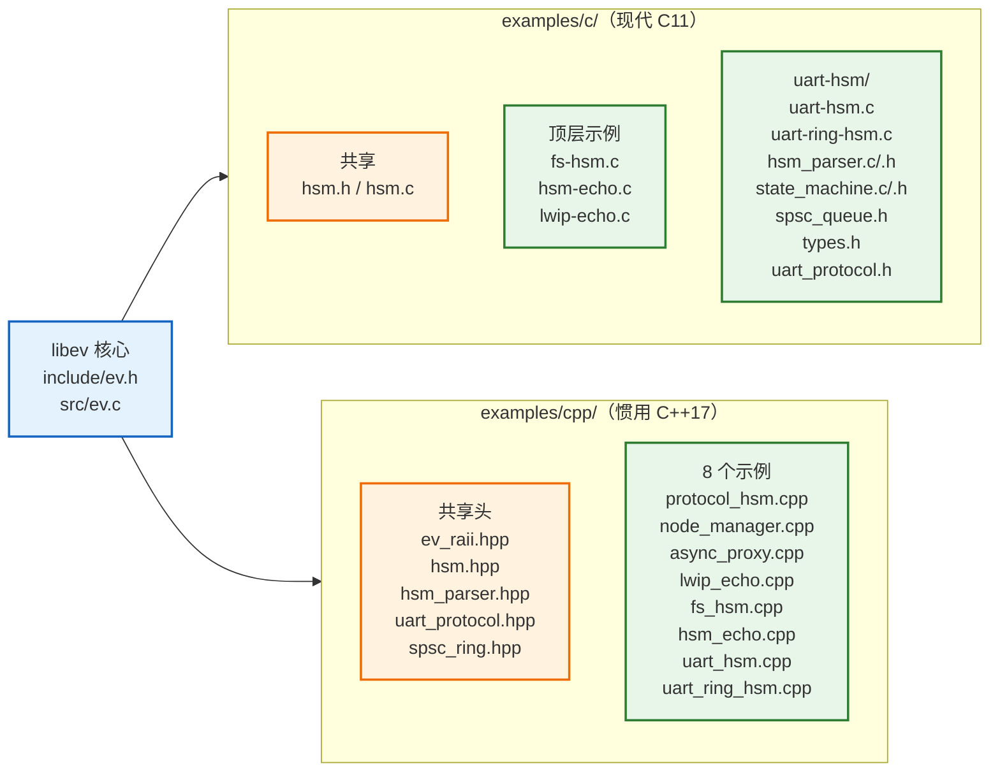
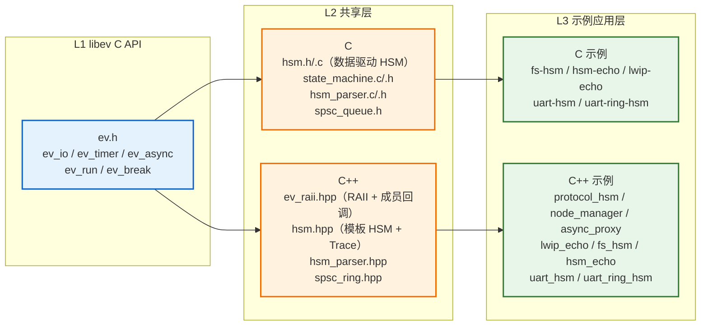
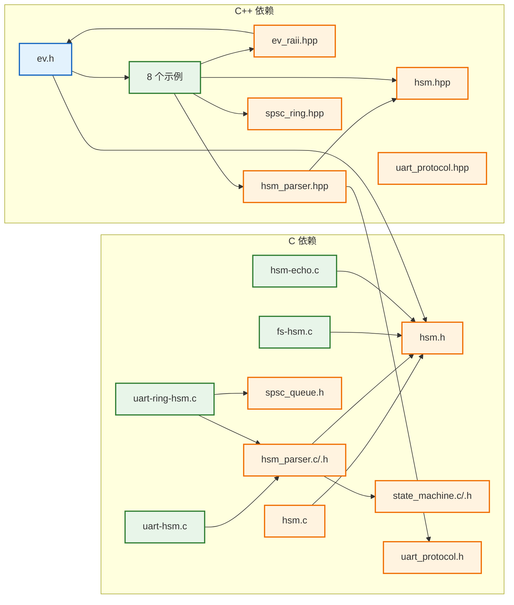

# libev Examples 概要设计

## 1. 概述

结论：libev 4.33 提供 C 与 C++17 两套示例代码，分别展示同一组事件驱动场景的两种实现风格。C 采用现代 C11 设计模式（上下文结构体 + `watcher->data` + 数据驱动 HSM），C++17 采用惯用 C++（RAII + 模板 HSM + 编译期 Policy），二者对称、共享同一 libev C API。

| 维度 | examples/c/ | examples/cpp/ |
|---|---|---|
| 语言标准 | C11 | C++17（禁异常） |
| 示例数量 | 5 个 | 8 个（C 的 5 个对应物 + 3 个全新） |
| 上下文传递 | `app_t` 结构体 + `watcher->data` | 类封装 + 成员函数指针回调 |
| 状态机 | `hsm.h/.c`（函数指针表） | `hsm.hpp`（模板 `Hsm<Context>`） |
| RAII | 无（手工 init/fini） | `ev_raii.hpp`（Loop/Io/Timer/Async） |
| 横切切面 | 无（业务回调内联） | 编译期 Trace Policy（零开销 AOP 替代） |

## 2. 目录拓扑

## 3. 分层架构

三层：L1 libev C API（事件循环原语）→ L2 共享层（语言侧抽象）→ L3 示例应用层（业务状态机）。

分层职责：L1 只提供 watcher 与事件循环；L2 是语言侧封装，C 侧提供数据驱动 HSM 引擎，C++ 侧提供 RAII watcher 包装与模板 HSM；L3 是具体业务，只依赖 L2 暴露的抽象，不直接触碰 L1 的裸结构体（C++ 侧严格隔离，C 侧通过 L2 的 `hsm_*` API 间接使用）。

## 4. 依赖关系

依赖方向自下而上：示例 → 共享层 → libev C API。C 侧 `hsm_parser` 复用 `state_machine` 引擎与 `hsm.h` 的 `hsm_t`；C++ 侧 `hsm_parser.hpp` 复用 `hsm.hpp` 模板并依赖 `uart_protocol.hpp` 的常量。两套示例的 uart 协议常量源出同门（C `uart_protocol.h` / C++ `uart_protocol.hpp`）。

## 5. 设计要点

### 5.1 现代 C 设计模式（examples/c/）

本轮重构将 5 个 C 示例从"全局变量 + `offsetof` 反推"改为现代 C 惯用法：

| 模式 | 重构前 | 重构后 |
|---|---|---|
| 上下文传递 | 全局变量 `g_fw` / `conn_head` / `g_parser` | `app_t` 结构体 + `watcher->data` |
| 连接定位 | `offsetof` 从 `ev_io` 反推 `conn` | `conn.io.data = conn` 直接绑定 |
| 回调上下文 | parser 回调忽略 `user_data` | `frame_cb` 用 `user_data` 传 `&app` |
| 布尔标志 | `int32_t` 存 0/1 | `bool`（stdbool.h） |
| 编译期校验 | 无 | `_Static_assert`（如 RING_SIZE 2 的幂） |

核心收益：消除全部文件级可变全局变量，每个示例可多实例化（多个 `app_t` 共存），状态与行为解耦到显式上下文。

### 5.2 惯用 C++17 设计模式（examples/cpp/）

| 模式 | 实现 | 位置 |
|---|---|---|
| RAII | `Loop`/`Io`/`Timer`/`Async` 析构自动释放 | ev_raii.hpp |
| 静态多态 | 成员函数指针模板 `Io<Self, &Self::cb>` | ev_raii.hpp |
| 编译期策略 | `Trace` 模板参数（默认 `NullTrace` no-op） | ev_raii.hpp / hsm.hpp |
| 非捕获 lambda | HSM 的 entry/exit/action 内联进静态表 | 各示例 |
| 固定宽度 | `int32_t`/`uint32_t`，边界 `static_cast` 回 libev 的 `int` | ev_raii.hpp |

编译期 Trace Policy 是运行期 AOP 插件的零开销替代：默认策略内联为空、完全消除，自定义策略注入日志/计时而无堆无虚表。

### 5.3 C 与 C++ 对称对照

| 场景 | C 示例 | C++17 示例 |
|---|---|---|
| 异步文件写 + worker | fs-hsm.c | fs_hsm.cpp |
| 连接生命周期 HSM | hsm-echo.c | hsm_echo.cpp |
| TCP echo server | lwip-echo.c | lwip_echo.cpp |
| UART 帧解析 HSM | uart-hsm.c | uart_hsm.cpp |
| ISR 环形缓冲 + ev_async | uart-ring-hsm.c | uart_ring_hsm.cpp |
| 连接协议 HSM | 无 | protocol_hsm.cpp |
| 多节点心跳 | 无 | node_manager.cpp |
| async 写代理 | 无 | async_proxy.cpp |

同一业务场景，C 用结构体 + 函数指针表表达，C++ 用类 + 模板 + lambda 表达，两者的分层结构（libev API → 共享层 → 应用层）完全一致。
